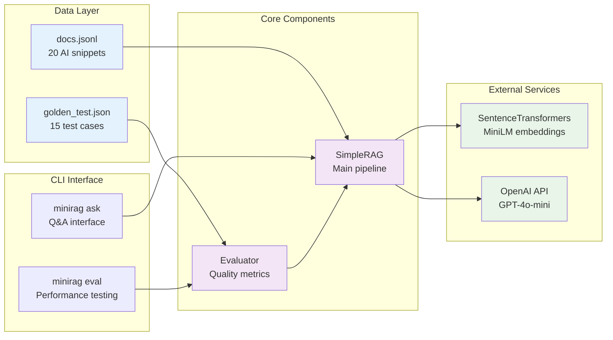

# Mini RAG System

A lightweight Retrieval-Augmented Generation (RAG) implementation for learning purposes, featuring dense retrieval with Haystack v2 components and OpenAI generation.

## Architecture Flow

```mermaid
graph TD
    A[User Query] --> B{CLI Command}
    
    B -->|minirag ask| C[SimpleRAG.ask()]
    B -->|minirag eval| D[Evaluator.evaluate()]
    
    C --> E[1. Setup Phase]
    E --> E1[Load docs.jsonl]
    E --> E2[Create Document Store]
    E --> E3[Generate Embeddings<br/>SentenceTransformers]
    E --> E4[Store in InMemoryDocumentStore]
    
    C --> F[2. Retrieval Phase]
    F --> F1[Embed Query<br/>Same Model as Docs]
    F1 --> F2[Similarity Search<br/>Cosine Distance]
    F2 --> F3[Return Top-K Documents<br/>with Scores]
    
    C --> G[3. Generation Phase]
    G --> G1[Format Context Prompt<br/>Include Retrieved Docs]
    G1 --> G2[OpenAI API Call<br/>GPT-4o-mini]
    G2 --> G3[Return Generated Answer<br/>with Citations]
    
    D --> H[Evaluation Flow]
    H --> H1[Load Test Cases<br/>golden_test.json]
    H1 --> H2[For Each Query]
    H2 --> H3[Measure Recall@K<br/>Retrieval Quality]
    H2 --> H4[Generate Answer]
    H4 --> H5[Measure Answer Quality<br/>Keyword Overlap]
    H3 --> H6[Evaluation Report]
    H5 --> H6
    
    style E fill:#e1f5fe
    style F fill:#f3e5f5
    style G fill:#e8f5e8
    style H fill:#fff3e0
```

## Component Overview



## Features

- **Dense Retrieval**: Uses Haystack v2 with sentence-transformers (MiniLM) for semantic search
- **OpenAI Generation**: Integrates with GPT-4o-mini for answer generation
- **Evaluation**: Recall@K metrics for retrieval quality assessment
- **Beautiful CLI**: Color-coded output with progress indicators
- **20 AI/ML documents**: Curated knowledge base about AI concepts

## Setup

```bash
# Create virtual environment
python3 -m venv .venv
source .venv/bin/activate  # On Windows: .venv\Scripts\activate

# Install in development mode
pip install -e .

# Configure OpenAI API key
cp .env.example .env
# Edit .env and add your OPENAI_API_KEY
```

## Usage

### Basic Q&A
```bash
minirag ask "What is RAG?"
```

### With source documents
```bash
minirag ask "How do embeddings work?" --show-sources
```

### Adjust retrieval count
```bash
minirag ask "What are transformers?" --k 5 --show-sources
```

## Evaluation

Run retrieval evaluation with Recall@K metrics:
```bash
minirag eval
```

Or run directly:
```bash
python -m minirag.cli ask "What is RAG?"
python -m minirag.cli eval
```

Output shows:
- Recall@1: 80% (4/5 queries get the right doc first)
- Recall@3: 100% (all queries find relevant docs in top 3)
- Recall@5: 100% (perfect recall at k=5)

## Example Output

```
Question: What is RAG?

Top 4 Retrieved Documents:
────────────────────────────────────────
  1. [id=1] (score: 0.367)
     Retrieval-Augmented Generation (RAG) combines a retriever with a generator...
  
Generating answer...

Answer:
────────────────────────────────────────
RAG stands for Retrieval-Augmented Generation, which combines a retriever 
with a generator to produce grounded answers [1].
────────────────────────────────────────
```

## Project Structure

```
.
├── app.py              # Main RAG application
├── eval.py             # Evaluation script
├── data/
│   ├── docs.jsonl      # Document collection (20 AI snippets)
│   └── golden_test.json # Test queries with ground truth
├── requirements.txt    # Python dependencies
└── .env               # API keys (create from .env.example)
```

## Technical Details

- **Embeddings**: 384-dimensional vectors from `all-MiniLM-L6-v2`
- **Retrieval**: Cosine similarity on normalized vectors
- **Generation**: OpenAI ChatCompletions API with citation prompting
- **Code**: ~150 lines total, clean and readable

## Learning Roadmap

Ready to level up? Here's a suggested learning path with increasing complexity:

### 🟢 **Beginner Extensions** (Start Here)
1. **Add More Document Types**: Load PDFs, Word docs, web scraping
2. **Improve Evaluation**: Add more test queries, measure answer quality
3. **Simple Caching**: Cache embeddings to disk, avoid re-computing
4. **Basic Error Handling**: Retry failed API calls, better error messages

### 🟡 **Intermediate RAG** (Build Production Skills)  
5. **Hybrid Search**: Combine semantic search + keyword (BM25) search
6. **Document Chunking**: Split long docs into smaller, searchable pieces
7. **Multiple Models**: Compare different embedding models (OpenAI, Cohere)
8. **Streaming Responses**: Stream OpenAI answers for better UX

### 🔴 **Advanced RAG** (Research-Level Techniques)
9. **Re-ranking**: Use cross-encoder models to re-rank retrieved docs
10. **Query Expansion**: Generate multiple query variations for better recall
11. **Vector Databases**: Replace in-memory with Pinecone/Weaviate/Chroma
12. **Agent Workflows**: Multi-step reasoning, tool use, function calling

### 🚀 **Production RAG** (Real-World Deployment)
13. **Evaluation Suite**: Automated testing, A/B testing, user feedback
14. **Monitoring**: Track performance, costs, user satisfaction  
15. **Security**: Input sanitization, rate limiting, content filtering
16. **Scalability**: Load balancing, distributed embeddings, cost optimization

**Next Suggested Step**: Pick one beginner extension and implement it! Start with #2 (better evaluation) to measure improvements.
